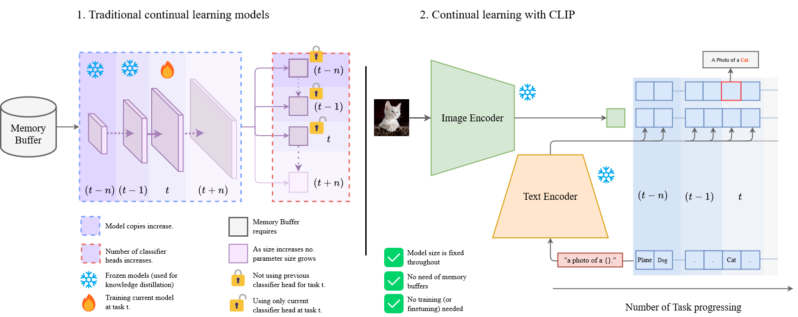
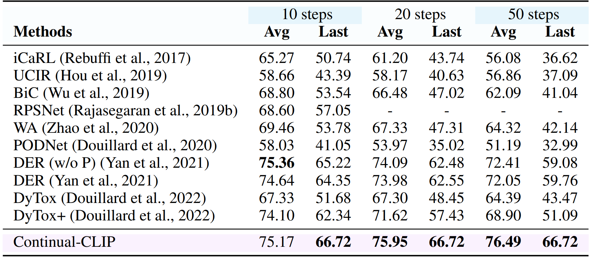

# Continual-CLIP: CLIP is an Efficient Continual Learner

> [**CLIP is an Efficient Continual Learner**](https://arxiv.org/abs/2210.03114)<br>
> by [Vishal Thengane](https://vgthengane.github.io/), [Salman Khan](https://salman-h-khan.github.io/), [Munawar Hayat](https://scholar.google.com.au/citations?user=Mx8MbWYAAAAJ&hl=en), [Fahad Khan](https://scholar.google.es/citations?user=zvaeYnUAAAAJ&hl=en)

[](https://arxiv.org/abs/2210.03114)


<hr />


## :rocket: News
* **(Oct 08, 2022)** 
  * Released code for [class incremental](configs/class) setting (other settings it will be added soon).
* **(Oct 03, 2022)** 
  * Repository created.
<hr />

<div align="center">


*Comparison of traditinal continual learning methods vs Continual-CLIP.*

</div>


## Abstract
The continual learning setting aims to learn new tasks over time without forgetting the previous ones. The literature reports several significant efforts to tackle this problem with limited or no access to previous task data. Among such efforts, typical solutions offer sophisticated techniques involving memory replay, knowledge distillation, model regularization, and dynamic network expansion. The resulting methods have a retraining cost at each learning task, dedicated memory requirements, and setting-specific design choices. In this work, we show that a frozen CLIP (Contrastive Language-Image Pretraining) model offers astounding continual learning performance without any fine-tuning (zero-shot evaluation). We evaluate CLIP under a variety of settings including class-incremental, domain-incremental and task-agnostic incremental learning on five popular benchmarks (ImageNet-100 & 1K, CORe50, CIFAR-100, and TinyImageNet). Without any bells and whistles, the CLIP model outperforms the state-of-the-art continual learning approaches in the majority of the settings. We show the effect on the CLIP model's performance by varying text inputs with simple prompt templates. To the best of our knowledge, this is the first work to report the CLIP zero-shot performance in a continual setting. We advocate the use of this strong yet embarrassingly simple baseline for future comparisons in the continual learning tasks. 

## Results

<div align="center">


*Comparison of SOTA CL methods on CIFAR100 benchmark in class-incremental setting.*

</div>

<hr />

## Installations
First clone the repository by running following command:
```bash
git clone https://github.com/vgthengane/Continual-CLIP.git
```

Then create an environment and install dependencies:
```bash
bash setup_environment.sh
``` 


## Running an experiments
Then run the following command (or use [run_experiment.sh](run_experiment.sh)) for the class-incremental settings (I'm taking an example of ImageNet-100 dataset for 10 classes in each task but you can use any other dataset and setting).

```bash
python main.py \
    --config-path configs/class \
    --config-name imagenet100_10-10.yaml \
    dataset_root="../datasets/" \
    class_order="class_orders/imagenet100.yaml"

```

## Dataset preparation
Dataset preparation instructions will be added soon. Sorry for the inconvenience.

<hr/>


## Citation
If you end up using our work, please consider citing:
```bibtex
@article{thengane2022continualclip,
  title={CLIP model is an Efficient Continual Learner},
  author={Thengane, Vishal and Khan, Salman and Hayat, Munawar and Khan, Fahad},  
  journal={arXiv:2210.03114},
  year={2022},
}
```

## Contact
If you have any questions, please create an issue on this repository or contact [Vishal Thengane](mailto:vishal.thengane@mbzuai.ac.ae?subject=[GitHub]%20Source%20Han%20Sans).


## Acknowledgements

Our code is based on [DyTox](https://github.com/arthurdouillard/dytox) repository. We thank the authors for releasing their code.
